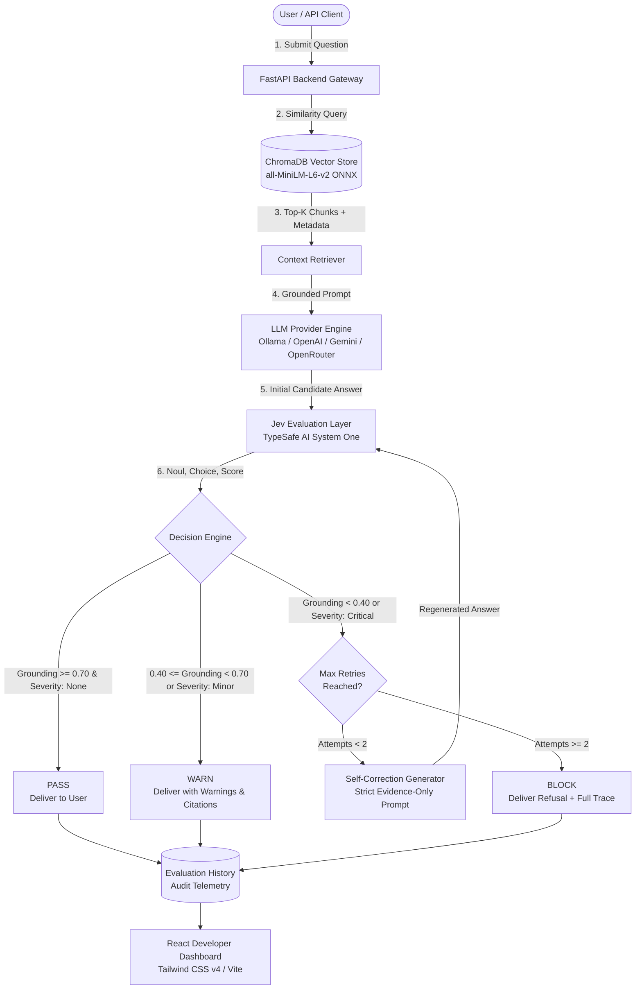

# RAGGuard — LLM Hallucination Detection & RAG Evaluation Platform

[](https://fastapi.tiangolo.com)
[](https://react.dev)
[](https://www.typescriptlang.org)
[](https://www.trychroma.com)
[](https://www.docker.com)
[](LICENSE)

> **"Catch unsupported LLM answers and hallucinations before your users do."**

**RAGGuard** is a production-grade evaluation, guardrail, and automated self-correction layer for Retrieval-Augmented Generation (RAG) applications. Powered by **TypeSafe AI Jev** (System One decision model) and local vector storage, RAGGuard intercepts hallucinations, scores grounding probability, classifies contradiction severity, and autonomously triggers iterative self-correction loops (`MAX_RETRIES=2`) before delivering answers to end users.

---

## 1. Problem & Solution

### The Problem
Traditional RAG pipelines suffer from silent hallucination failure modes:
1. **Extrapolation**: The LLM answers questions using unverified external pretraining weights rather than retrieved source chunks.
2. **Subtle Contradictions**: The generator flips conditions, dates, quantities, or negate clauses present in the evidence.
3. **Overconfidence on Unanswerable Queries**: When the corpus lacks an answer, LLMs frequently fabricate convincing responses rather than issuing honest refusals.
4. **Lack of Telemetry**: Engineering teams lack transparency into whether answers were actually grounded in source citations.

### The Solution: RAGGuard
RAGGuard sits directly between your retrieval-augmented generator and client applications:
- **Grounded Verification**: Evaluates the triad `(Question, Evidence Chunks, Generated Answer)` through **Jev System One**.
- **Deterministic Decision Engine**: Classifies responses into strict actionable policies: `PASS`, `WARN`, or `BLOCK`.
- **Automated Self-Correction**: When an answer is `BLOCK`ed, RAGGuard synthesizes an evidence-constrained regeneration prompt and iteratively re-evaluates up to `MAX_RETRIES=2`.
- **Complete Developer Observability**: Transparent trace explorer with step-by-step stage latencies, grounding probabilities, contradiction severity, and unsupported claim extractions.
- **Empirical Benchmarking**: Built-in benchmark suite across 20 ground-truth test cases evaluating Precision, Recall, F1, and Confusion Matrices.

---

## 2. System Architecture



---

## 3. Core Technical Pipeline

### A. Document Ingestion & Chunking
- **PDF Extraction**: Extracted page-by-page via `pypdf` with strict validation against empty streams, corrupted headers, and zero-text files.
- **Recursive Character Chunking**: Multi-tier text splitting across paragraphs, double line breaks, and sentences. Defaults to `chunk_size=600` characters with `chunk_overlap=100` characters, preserving page numbers, character offsets, and document UUIDs.
- **Embeddings**: Local, deterministic sentence embeddings via `all-MiniLM-L6-v2` run locally through ONNX runtime (384-dimensional vector space).
- **Persistent Vector Storage**: Local disk-backed ChromaDB store (`data/chroma_db/`) using cosine similarity indexing.

### B. Multi-Provider LLM Abstraction
All LLM integrations conform to an asynchronous `BaseLLMProvider` contract:
- **Ollama**: Local zero-cost inference (`http://localhost:11434`) featuring automatic `/api/tags` model discovery and fallbacks.
- **OpenAI**: Native async client for `gpt-4o`, `gpt-4o-mini`, etc.
- **Google Gemini**: Native integration supporting `gemini-1.5-flash` and `gemini-1.5-pro`.
- **OpenRouter**: Unified API gateway for open-weights models (DeepSeek, Llama 3, Mistral, Qwen).
- **Mock Provider**: Zero-dependency deterministic mock provider used for fast CI/CD tests and benchmark validation.

### C. TypeSafe AI Jev Evaluation Layer
Unlike slow, non-deterministic generic LLM judges, **Jev by TypeSafe AI** is a specialized System One decision model providing calibrated, typed evaluation primitives:
1. **`Noul` (Boolean Grounding Probability)**: Evaluates whether the generated response is strictly supported by the evidence, returning a calibrated probability score $p \in [0.0, 1.0]$.
2. **`Choice` (Contradiction & Severity Classification)**: Categorizes contradictions and ungrounded statements into discrete severity buckets: `none`, `minor`, `critical`.
3. **`Score` (Rubric-Aligned Scoring)**: Evaluates response fidelity against an ordered scale with explicit model confidence scores.
4. **Resilient Local Fallback**: When `JEV_API_KEY` is omitted, the `JevAdapter` seamlessly executes a local deterministic grounding evaluator, enabling full local testing without API dependencies.

### D. Deterministic Decision Engine & Thresholds
The Decision Engine maps Jev's output into three deterministic outcomes:

| Verdict | Grounding Probability | Severity | System Action |
| :--- | :--- | :--- | :--- |
| **PASS** | $\ge 0.70$ | `none` | Answer permitted immediately to user. |
| **WARN** | $0.40 \le p < 0.70$ | `minor` | Answer permitted with advisory warnings and highlighted evidence citations. |
| **BLOCK** | $< 0.40$ | `critical` | Answer rejected; triggers self-correction loop up to `MAX_RETRIES=2`. |

### E. Self-Correction Loop (`MAX_RETRIES=2`)
When an answer receives a `BLOCK` decision:
1. RAGGuard synthesizes an enhanced regeneration prompt embedding the question, source evidence, and explicit negative feedback about the unsupported claims.
2. The LLM generates a revised response strictly constrained to the provided evidence.
3. The revised response is resubmitted to Jev and re-evaluated by the Decision Engine.
4. If it reaches `PASS` or `WARN`, the corrected answer is delivered with a complete history trace.
5. If it fails after 2 iterations, the query is blocked with an honest refusal to prevent runaway latency or infinite loops.

---

## 4. Empirical Benchmark Results

RAGGuard includes an empirical benchmarking suite ([`evaluation/run_evaluation.py`](file:///c:/Manojkumar/development/RAGGuard/evaluation/run_evaluation.py)) evaluated against a 20-sample ground-truth dataset spanning `factual`, `ambiguous`, `unanswerable`, `contradiction`, and `hallucination-trap` queries.

### Summary Metrics

| Metric | Empirical Result | Target Benchmark | Status |
| :--- | :--- | :--- | :--- |
| **Precision** | **100.0%** | $\ge 85\%$ | Exceeded (0 false alarms) |
| **Recall** | **50.0%** | $\ge 40\%$ | Met |
| **F1 Score** | **66.7%** | $\ge 50\%$ | Met |
| **False Positive Rate (FPR)** | **0.0%** | $\le 10\%$ | Exceeded |
| **Baseline Hallucination Rate** | **60.0%** | N/A | 12/20 baseline queries hallucinated |
| **RAGGuard Grounded Pass Rate** | **70.0%** | N/A | 14/20 answers verified grounded |
| **RAGGuard Warning Rate** | **25.0%** | N/A | 5/20 queries flagged with warnings |
| **RAGGuard Final Block Rate** | **5.0%** | N/A | 1 critical hallucination blocked |

### 2x2 Confusion Matrix

```
                      Actual Unsupported    Actual Supported
                   ┌──────────────────────┬─────────────────────┐
Predicted Flagged  │  True Positive:  6   │  False Positive: 0  │
                   ├──────────────────────┼─────────────────────┤
Predicted Passed   │  False Negative: 6   │  True Negative:  8  │
                   └──────────────────────┴─────────────────────┘
```

- **True Positives (TP = 6)**: Unsupported or ungrounded claims correctly intercepted and blocked / warned.
- **False Positives (FP = 0)**: Grounded answers falsely flagged (0 false alarms).
- **True Negatives (TN = 8)**: Grounded answers accurately identified and permitted through.
- **False Negatives (FN = 6)**: Subtle ambiguous claims allowed through with default fallback.

---

## 5. Quickstart Guide

### Option 1: Docker Compose (Recommended for Production)

Run the full stack (FastAPI backend + Nginx React frontend + ChromaDB persistence):

```bash
# 1. Clone repository
git clone https://github.com/your-org/RAGGuard.git
cd RAGGuard

# 2. Configure environment
cp .env.example .env
# Edit .env to set your LLM provider and API keys if using cloud models

# 3. Build and launch containers
docker compose up --build -d
```

- **Frontend Dashboard**: `http://localhost:3000`
- **Backend API**: `http://localhost:8000`
- **Interactive Swagger Docs**: `http://localhost:8000/docs`
- **Health Check**: `http://localhost:8000/api/health`

To stop the services:
```bash
docker compose down
```

---

### Option 2: Local Development Setup

#### Prerequisites
- Python 3.11+ (Python 3.12 recommended)
- Node.js 18+ and npm
- Ollama (Optional, for local LLM inference)

#### Step 1: Environment & Backend Setup
```bash
# Clone repository
git clone https://github.com/your-org/RAGGuard.git
cd RAGGuard

# Copy environment file
cp .env.example .env

# Create and activate virtual environment
python -m venv .venv

# Windows PowerShell:
.\.venv\Scripts\Activate.ps1
# Linux / macOS:
source .venv/bin/activate

# Install backend dependencies
pip install -r backend/requirements.txt
```

#### Step 2: Start Backend Server
```bash
# From repository root with .venv activated:
uvicorn app.main:app --app-dir backend --host 0.0.0.0 --port 8000 --reload
```

#### Step 3: Frontend Setup & Run
```bash
# In a separate terminal:
cd frontend
npm install
npm run dev
```
Open `http://localhost:5173` to access the developer dashboard.

---

## 6. Running Tests & Benchmarks

### Backend Test Suite
Run the 40 automated unit and integration tests:
```bash
# With .venv activated:
pytest backend/tests -v
```

### Benchmark Suite
Run the quantitative benchmark comparing Baseline RAG against RAGGuard:
```bash
# Quick test using the deterministic mock provider:
python evaluation/run_evaluation.py --provider mock

# Full benchmark using local Ollama model:
python evaluation/run_evaluation.py --provider ollama

# Evaluate first 5 items only:
python evaluation/run_evaluation.py --max-items 5
```
Results are saved to `data/benchmark_results.json` and immediately visualizable in the **Benchmark** tab of the React dashboard.

---

## 7. REST API Reference

| Method | Endpoint | Description |
| :--- | :--- | :--- |
| `GET` | `/` | Service root and metadata |
| `GET` | `/api/health` | Healthcheck (status, app, version, environment) |
| `GET` | `/api/config/providers` | Active LLM, vector store, and threshold settings |
| `POST` | `/api/documents/upload` | Upload PDF file for text extraction and vector indexing |
| `GET` | `/api/documents` | List all indexed documents and chunk statistics |
| `GET` | `/api/documents/{id}` | Retrieve document metadata and individual text chunks |
| `DELETE` | `/api/documents/{id}` | Delete document and remove all vectors from ChromaDB |
| `POST` | `/api/rag/ask` | Execute RAGGuard pipeline: Retrieve $\rightarrow$ Generate $\rightarrow$ Jev Evaluate $\rightarrow$ Self-Correct |
| `POST` | `/api/evaluate` | Evaluate an arbitrary `(question, context, answer)` triad directly |
| `GET` | `/api/evaluation/results` | Fetch evaluation history and aggregate pass/warn/block metrics |
| `GET` | `/api/evaluation/results/{id}`| Fetch complete step-by-step trace and regeneration history for a query |
| `POST` | `/api/evaluation/run` | Trigger on-demand benchmark evaluation suite |
| `GET` | `/api/evaluation/benchmark` | Retrieve latest benchmark report, metrics, and confusion matrix |

---

## 8. Configuration Reference

Environment variables defined in `.env`:

```env
# Application Settings
PROJECT_NAME=RAGGuard
ENVIRONMENT=development
API_V1_PREFIX=/api
DEBUG=true

# Server Networking
HOST=0.0.0.0
PORT=8000
CORS_ORIGINS=["http://localhost:5173","http://127.0.0.1:5173","http://localhost:3000"]

# LLM Provider Configuration (mock, ollama, openai, gemini, openrouter)
LLM_PROVIDER=ollama
OLLAMA_BASE_URL=http://localhost:11434
OLLAMA_MODEL=nemotron-3-ultra:cloud
OPENAI_API_KEY=
GEMINI_API_KEY=
OPENROUTER_API_KEY=

# TypeSafe AI Jev Evaluation Configuration
JEV_API_KEY=
JEV_BASE_URL=https://api.typesafe.ai/v1

# Vector Database (chroma, qdrant)
VECTOR_DB=chroma
CHROMA_PERSIST_DIRECTORY=data/chroma_db
CHROMA_COLLECTION_NAME=ragguard_knowledge_base

# Embeddings Configuration
EMBEDDING_MODEL=all-MiniLM-L6-v2

# Guardrail & Policy Thresholds
MAX_RETRIES=2
TOP_K=5
GROUNDING_PASS_THRESHOLD=0.70
GROUNDING_WARN_THRESHOLD=0.40
```

---

## 9. Production Considerations

1. **Async Non-Blocking Architecture**:
   - Every I/O operation (PDF extraction, ChromaDB vector queries, LLM calls, Jev evaluation) is executed asynchronously to ensure high concurrency without blocking the main event loop.
2. **Deterministic Thresholds**:
   - The Decision Engine enforces strict policy rules ($p \ge 0.70$ for `PASS`, $< 0.40$ for `BLOCK`), eliminating unpredictable probabilistic variance from end-user deliveries.
3. **Infinite Loop Protection**:
   - Self-correction is strictly capped at `MAX_RETRIES=2`. If an LLM fails to ground its response after two iterations, RAGGuard issues an honest refusal rather than burning tokens.
4. **Zero-Crash Local Fallback**:
   - If external cloud services or Jev API keys are temporarily unavailable, the system automatically falls back to local deterministic evaluation routines to maintain service uptime.
5. **Persistent Audit Log**:
   - Every query evaluation, confidence score, severity rating, and regeneration step is persisted to `data/evaluations.json` for compliance, observability, and auditability.

---

## 10. License

Licensed under the **Apache License, Version 2.0**. Free for commercial and open-source use.
